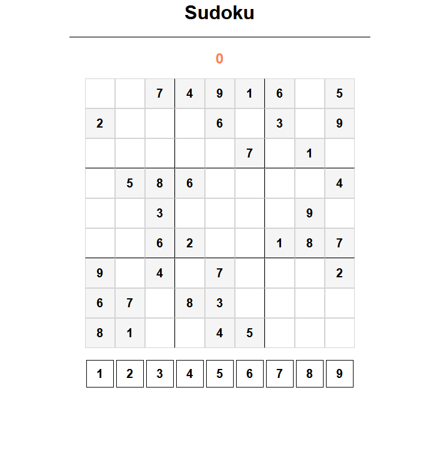

<a id="readme-top"></a>
<!-- PROJECT LOGO -->
<br />
<div align="center">
  <a href="https://github.com/DiAngello">
    
  </a>

  <h3 align="center">Projeto Sudoku</h3>

  <p align="center">
    Um jogo de Sudoku simples feito com HTML, CSS e JavaScript.
    <br /></p>
</div>
 
<p align="center">
  
</p>

<!-- TABLE OF CONTENTS -->
<details>
  <summary>Sumário</summary>
  <ol>
    <li>
      <a href="#about-the-project">Sobre o projeto</a>
      <ul>
        <li><a href="#built-with">Tecnologias</a></li>
      </ul>
    </li>
    <li>
      <a href="#getting-started">Como iniciar</a>
      <ul>
        <li><a href="#prerequisites">Pré-requisitos</a></li>
        <li><a href="#installation">Instalação</a></li>
      </ul>
    </li>
    <li><a href="#usage">Uso</a></li>
    <li><a href="#contact">Contatos</a></li>
  </ol>
</details>

<!-- ABOUT THE PROJECT -->
## Sobre o projeto 💡



Este é um jogo de Sudoku simples onde o objetivo é completar o tabuleiro com números de 1 a 9 sem repetir em linhas, colunas e subquadrantes 3x3.

<p align="right">(<a href="#readme-top">Voltar ao topo</a>)</p>

<!-- BUILT WITH -->
### Tecnologias 🚀

* 
* 
* 

<p align="right">(<a href="#readme-top">Voltar ao topo</a>)</p>

<!-- GETTING STARTED -->
## Como iniciar ▶️

### Instalação 📦

1. Clone o repositório:
   ```sh
   git clone https://github.com/DiAngello/sudoku.git

2. Abra o arquivo index.html em seu navegador.

<p align="right">(<a href="#readme-top">Voltar ao topo</a>)</p> 

<!-- USAGE EXAMPLES -->

## Uso 📌

* Clique nos números abaixo do tabuleiro para selecionar o número desejado.
* Clique nas células do tabuleiro para preencher com o número selecionado.
* O contador de erros aumentará sempre que um número errado for colocado em uma célula.

<p align="right">(<a href="#readme-top">Voltar ao topo</a>)</p> 

<!-- CONTACT -->

## Contatos 🌟

Andressa de Souza - aka DiAngello - andressa.gabrielly.ofc@gmail.com

Link do projeto: https://github.com/DiAngello/sudoku

<p align="right">(<a href="#readme-top">Voltar ao topo</a>)</p> 
